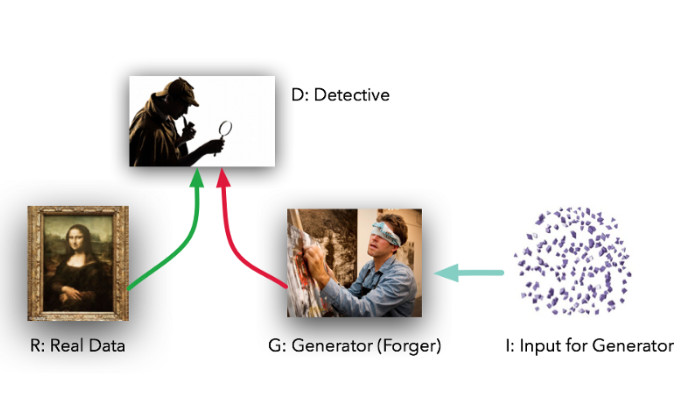
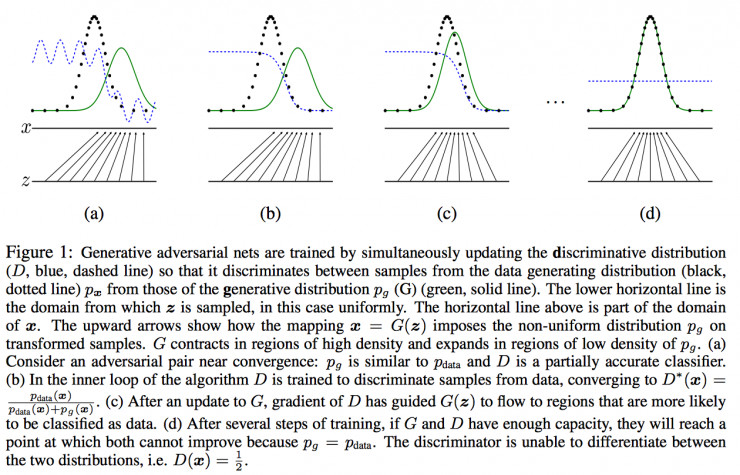
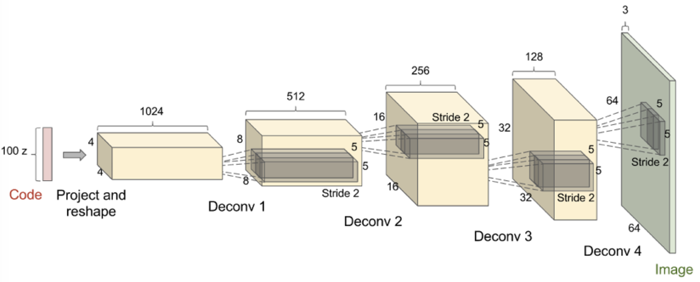
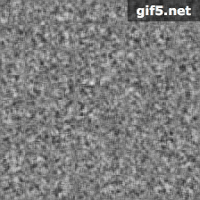
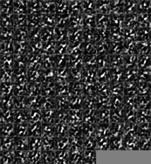
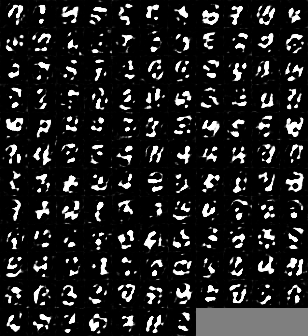
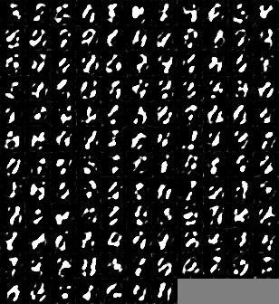
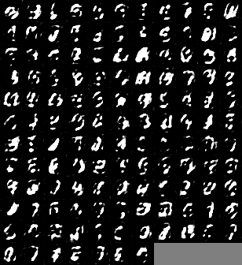
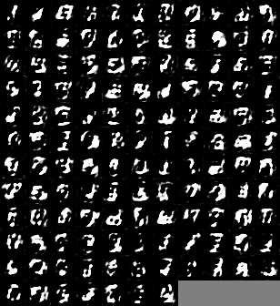
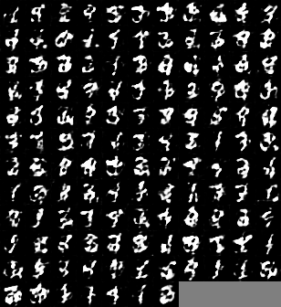

# Generative Adversarial Network (GAN) and Application

## Generative model

What is generative model? In general, we divide machine learning algorithms into two classes: generative model and discriminative model. The difference between these two models is that generative model estimate the joint probability of the input data and labels simultaneously, however, the discriminative model learns a function that maps the input data to some desired output class label, In probabilistic terms, they directly learn the conditional distribution.

The common discriminative models include LogisticRegression, SVM, Neural Network and so on. Also, common generative model include Naive Bayes, GMM, Bayesian Network, MRF etc.

### Why we study generative model

There are several properties of generative model:

* In the area of applied of mathematics and engineering, the generative model can effectively represent the distribution of high-dimensional data
* Generative model can be used to help reinforcement learning, and effectively show the state in reinforcement learning
* Generative model also show good quality on the semi-supervised learning, also can train the model with missing data, and give the corresponding output with missing data input
* The generative model can also work effectively on one input and multiple outputs. A specific application is to predict the next frame of videos

Applications of generative model:

* Image Super Resolution
* iGAN: [Generative Visual Manipulation on the Natural Image Manifold](https://www.youtube.com/watch?v=9c4z6YsBGQ0)
* Image conversion

### Generative model family

This diagram covers the basic method of generative models. We could group the models based on if we need to define the probability density function:

* Explicit density models: VAE lower bound, Markov chain Monte Carlo (MCMC) methods
* Implicit density models: Markov chain, GAN

## Generative Adversarial Network (GAN)

What is GAN? In 2014, Ian Goodfellow and his colleagues at the University of Montreal published a paper which shocked the academic. Yeah, I'm talking about ["Generative Adversarial Nets"](https://arxiv.org/pdf/1511.06434.pdf), which marks the birth of Generative Adversarial Network (GAN), which is a creative combination of computer graph and game theory. Their research shows that two models can be trained by simple back propagation.
 
 The role of these two models is very clear. Given a real data set R, G is a generator whose task is to generate false data that can be fake; and D is a discriminator that takes data from a real data set or G and then makes a distinction if it is true or false. We could say that G is like a fake workshop, want to make things as close as possible to the real thing. And D is the artifact identification experts, and is able to distinguish between genuine and high imitation (but in this case, counterfeit G can not see the original data, but only D identification results).

Ideally, both D and G will become better and better with continuous training - until G becomes a "fake master", and D could not correctly distinguish between the real data and fake data.

Essentially, this technique is: G performs an unsupervised learning on the original data set and find a way to represent the data in a lower-dimensional manner. And unsupervised learning is so important, as Yann LeCun said "unsupervised learning is the cake." This cake here, referring to the "real AI", which countless scholars, developers pursuing.

>_"There are many interesting recent development in deep learning... The most important one, in my opinion, is adversarial training (also called GAN for Generative Adversarial Networks). This, and the variations that are now being proposed is the most interesting idea in the last 10 years in ML, in my opinion."_ - **Yann LeCun**

### How GAN works

There are very detailed mathematical derivation in Goodfellow's paper. However, it is a little difficult for beginners to read all the mathematical stuff. Here is a graph easier to understand.

In the figure, the black dotted line is the real data distribution Pdata, the green line is the PG represented the generator, and the discriminator is the blue dotted line. (a) is the initial state, and then update the parameters of Discriminator, after a few steps, when discriminator has a better judgment, we come to (b) state. Then update G (Green) is closer to the distribution of the real data. After several updates of the G and D model parameters, theoretically, we would come to the state of (d), i.e., G can produce exactly the same as the real data. One application could be that generating a face image from a random data distribution.

### How to train GAN

The structure of GAN is different from other deep learning models. It applied a method called simultaneous SGD. In each step, there will be two gradient optimization process, one is to update parameters of the discriminator to minimize JD, another is to update parameters of the generator to the minimum JG. Usually we could choose Adam as the optimizer (Adam: A Method for Stochastic Optimization), however, there is a suggestion that you can update the generators and discriminator with different times. Based on the relevant work, 1: 1 of the update times is more effective in practice. In the [GAN tutorial](https://arxiv.org/pdf/1701.00160.pdf) of Goodfellow, there are more code in detail with different cost function, where you can refer to.

#### DCGAN

After GAN came out, a lot of related applications and methods are based on DCGAN structure, which means "Deep Convolution GAN". Usually are some common rules:

* In most of the layers in discriminator and generator, batch normalization is applied, however in the last layer, batch normalizaiton is not usually used. The purpose is to ensure that the model can learn the correct mean and variance of data
* The image is generated from the random distribution, when we have to increase the dimension of the image, usually we use a deconv (transposed convolution) with strdie = 2
* The Adam optimizer algorithm is usually used in DCGAN instead of SGD.

In this project, I applied DCGAN to show how it works.

## Application with DCGAN -- Generating handwriting

### Problem explanation

In this project, I want to use the MNIST data set as the real data to train a DCGAN model, so that it could generate a graph of hand writing that we can hardly tell it is real or not.

At the beginning, our model generate a random distribution as the original graph, then it would learn from the discriminator and improve its skill to generate the fake handwriting.

Finally, if the time is long enough, we could get a graph that is very close to the real data set. However, due to the performance of my laptop and the due data, I only run the model for 10 epoch, we could see that it is more and more close to the digits.
 
### Data set

In this project, I use the MNIST data set as the real data for training the GAN model. The dataset is included in keras, so there is no need to download large files. Also, MNIST is gray image, only one dimension, which would be easier to train and predict, comparing to the colored images.

### Load data and generate noise distribution

As I talked above, we could easily import the real data (MNIST) from keras datasets.

    from keras.datasets import mnist
    def load_data():
        (X_train, y_train), (X_test, y_test) = mnist.load_data()
        X_train = (X_train.astype(np.float32) - 127.5) / 127.5
        X_train = X_train.reshape((X_train.shape[0], 1) + X_train.shape[1:])
    
        return X_train

Also, we need to generate the noise distribution.

    def gen_noise(BATCH_SIZE):
        noise = np.zeros((BATCH_SIZE, 100))
        for i in range(BATCH_SIZE):
            noise[i, :] = np.random.uniform(-1, 1, 100)
    
        return noise

### Generator and discriminator

I use keras layer as in generator and discriminator models. The code is long so that I do not copy the code here, you can check the code for details.

In generator, there are 2 dense layers and 2 Convolution 2D layers.

In discriminator, there are 2 Convolution 2D layers, 2 MaxPooling layers and two dense layers.

Here, I applied SGD as the optimizer

        d_opt = SGD(lr = 0.0005, momentum = 0.9, nesterov = True)
        g_opt = SGD(lr = 0.0005, momentum = 0.9, nesterov = True)

### Results

Here, I put a GIF here, to show the process the generator learn to make a fake image.

We could see that at first, it is very unclear to see what it is. After several epoch, we could tell it is the digits, though it is still unclear.
 
If there is more time to run the model, we could get a result as close as the real data.

 
 
 

### Discussion

Same as other deep learning models, GAN is also time consuming, to run the model for 100 epoch, it may be take 24h to finish for my laptop. However, the result of the GAN is so amazing, it could learn the most dominate characteristic of an image, and generate one that we could not tell it is real or not.

I also find that, the results is not always become better, it would oscillate in the learning process. In order to have a better result, we could add more layers and use small sampling size.

In the future study, we could implement the model to colored images. Such as generate a real face or generate a dog or cat with the generator.
 
